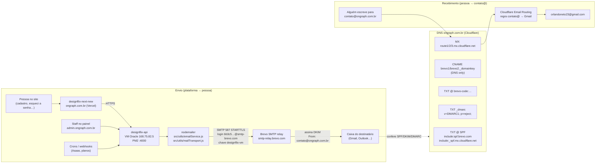

# Arquitetura de e-mail da plataforma Designflix / ON Graph

Como a plataforma manda e-mail (código de cadastro, redefinição de senha, avisos de plano…) e como recebe e-mail em `contato@ongraph.com.br`. Este é o doc de **visão geral**; os detalhes operacionais estão em:

| Doc | Assunto |
|-----|---------|
| [email-smtp-brevo.md](./email-smtp-brevo.md) | Conta Brevo, chave SMTP, IPs autorizados, teste pela VM |
| [email-cloudflare.md](./email-cloudflare.md) | Registros DNS (SPF, DKIM, DMARC, MX), Email Routing, como reverter |
| [LOCAL-MAILPIT.md](./LOCAL-MAILPIT.md) | E-mail no desenvolvimento local |
| [deploy-oracle.md](./deploy-oracle.md) | Como as variáveis chegam na VM |

**Estado em:** 2026-09-26 (API 1.1.0).

---

## 1. Objetivo

- Todo e-mail que a plataforma envia sai **de `Designflix <contato@ongraph.com.br>`**, do domínio próprio, autenticado (SPF + DKIM + DMARC) para não cair em spam nem ser rejeitado.
- Quem responde ou escreve para `contato@ongraph.com.br` recebe a mensagem no Gmail do Orlando (`orlandoneto23@gmail.com`).
- Custo zero: Brevo Free (envio) + Cloudflare Email Routing (recebimento).

## 2. Visão geral (diagrama)

Em texto: a API monta o e-mail com um template Handlebars (`src/views/*.hbs`) e entrega ao **Brevo** por SMTP na porta **587**. O Brevo envia em nome de `contato@ongraph.com.br`, assinando com DKIM. O servidor de quem recebe consulta o DNS no **Cloudflare** (SPF, DKIM, DMARC) e aceita a mensagem. O recebimento é outro caminho: os MX do domínio apontam para o **Cloudflare Email Routing**, que só encaminha para o Gmail.

## 3. Por que cada peça existe

| Peça | Por quê |
|------|---------|
| **Brevo** (relay SMTP) | A Oracle Cloud **bloqueia a porta 25** de saída, então a VM não entrega e-mail direto. O SMTP antigo (Hostinger) **não existe mais** (servidor desativado). O Brevo aceita SMTP na 587, é grátis até **300 e-mails/dia** e autentica o domínio. |
| **Porta 587 + STARTTLS** | Aberta na Oracle; conexão criptografada. `secure=false` na 587 (o TLS sobe via STARTTLS); `secure=true` só se um dia usar 465. |
| **Chave SMTP `designflix-vm`** | Credencial só da API. Se vazar, é revogada no Brevo sem afetar mais nada. |
| **IPs autorizados (Brevo)** | Bloqueio ligado: só **`168.75.82.5`** (a VM) consegue usar as chaves SMTP. Uma chave vazada não serve de outro lugar. |
| **SPF** (`include:spf.brevo.com`) | Diz ao mundo que os servidores do Brevo podem enviar pelo domínio. |
| **DKIM** (`brevo1`/`brevo2._domainkey`) | Assinatura criptográfica de cada mensagem; prova que não foi alterada e que veio de quem o domínio autoriza. |
| **`brevo-code`** (TXT) | Prova ao Brevo que o domínio é nosso (verificação da conta). |
| **DMARC** (`p=reject`) | Manda os provedores **rejeitarem** mensagem com `From: @ongraph.com.br` que falhe SPF/DKIM → ninguém falsifica o domínio. Por isso o DKIM precisa estar certo: senão o nosso próprio e-mail é rejeitado. |
| **Cloudflare Email Routing** | Recebe `contato@` sem pagar caixa postal; só encaminha para o Gmail. |
| **Mailpit** (dev) | No PC, e-mails vão para uma caixa falsa local (`http://localhost:8025`); nada sai para a internet e a chave de produção nem funciona fora da VM. |

## 4. Quais e-mails a plataforma envia

Todos passam por `sendEmail()` em [`src/utils/emailService.js`](../src/utils/emailService.js) (transporte de [`mailTransport.js`](../src/utils/mailTransport.js), remetente `EMAIL_FROM`). Templates em `src/views/`.

| E-mail | Quando | Código | Template |
|--------|--------|--------|----------|
| Código de verificação (OTP) do cadastro | Pessoa pede o código no cadastro (`GET /otps/send`) | `auth-public.service.js` → `sendOtp` | `otps.hbs` |
| Boas-vindas / conta criada | Cadastro concluído (`POST /user`) | `auth-public.service.js` → `register` | `index.hbs` |
| Redefinição de senha (site) | "Esqueci a senha" no site (`POST /forgot-password`) — link JWT de 15 min | `auth-public.service.js` → `forgotPassword` | `forgot.hbs` |
| Redefinição de senha (admin) | "Esqueci minha senha" no painel (`POST /admin/reset-password`) — link de uso único, 30 min | `admin.service.js` → `sendResetEmail` | `adminResetPassword.hbs` |
| Pedido de colaborador (para a pessoa) | Pessoa se candidata a colaborador | `contributor.service.js` → `notifyApply` | `contributorRequest.hbs` |
| Pedido de colaborador (para moderadores) | Idem; vai para `CONTRIBUTOR_MODERATOR_EMAILS` | `contributor.service.js` → `notifyApply` | `contributorRequestAdmin.hbs` |
| Avisos de plano: em atraso, suspenso, expirado, cancelado | Webhooks/assinaturas Asaas e job de suspensão | `plans/plan-notifications.js` → `sendPlanNotice` | `planStatusNotice.hbs` |
| Assinatura criada / atualizada / reembolso (Stripe, legado) | Webhooks do Stripe (base antiga) | `paymentStripe.service.js` | `customerSubscriptionCreated.hbs`, `customerSubscriptionUpdated.hbs`, `chargeRefund.hbs` |
| Plano removido após cancelamento (Stripe, legado) | Cron `removeStripeExpiredPlansJob` | `cron/removeStripeExpiredPlansJob.js` | `customerSubscriptionDeleted.hbs` |

`renewPlan.hbs` existe em `src/views/` mas nenhum código usa hoje.

Os links dos e-mails usam `FRONTEND_URL` (site) e `ADMIN_PANEL_URL` (painel); as imagens usam `API_URL`.

## 5. Onde fica cada configuração

| O quê | Onde |
|-------|------|
| Variáveis SMTP (`EMAIL_HOST_SMTP`, `EMAIL_PORT_SMTP`, `EMAIL_USER_SMTP`, `EMAIL_PASS_SMTP`, `EMAIL_FROM`, `EMAIL_USE_MAILPIT=false`) | `C:\projetos\designflix-api\.env.production` (gitignored, fonte da verdade) → `npm run deploy:oracle` → `/home/opc/designflix-api/.env` na VM (`chmod 600`). Modelo sem segredos: [`env.production.example`](../env.production.example) |
| Links | `FRONTEND_URL`, `ADMIN_PANEL_URL`, `API_URL` no mesmo `.env` |
| Moderadores de colaborador | `CONTRIBUTOR_MODERATOR_EMAILS` (vírgula) |
| Chave SMTP, remetentes, domínio, IPs autorizados, logs de envio | Painel Brevo <https://app.brevo.com> (login Google `orlandoneto23@gmail.com`) |
| SPF, DKIM, DMARC, MX, Email Routing | Cloudflare → zona `ongraph.com.br` (conta `orlandoneto23@gmail.com`) |
| Dev local | `.env.development` com Mailpit ([LOCAL-MAILPIT.md](./LOCAL-MAILPIT.md)) |

A chave SMTP **nunca** vai para o Git (o repositório é público).

## 6. Limites e o que fazer se estourar

| Limite | Valor | Se estourar |
|--------|-------|-------------|
| Brevo Free | **300 e-mails/dia** (conta inteira) | Os excedentes falham até o dia seguinte (erro no log `[Email] Erro ao enviar`). Ver volume em Brevo → Transactional → Statistics. Solução: plano pago (Starter) ou outro provedor na 587 (só trocar `EMAIL_*` e o SPF/DKIM) |
| Reset de senha do admin | 1 pedido por conta a cada 60 s | Esperar |
| Validade dos links | Site 15 min · Admin 30 min | Pedir outro link |

## 7. Como testar

1. **Fluxo real:** no site, cadastro com um e-mail seu (recebe o código) ou "Esqueci a senha"; no painel, "Esqueci minha senha".
2. **Pela VM** (usa o transporte da app): comando em [email-smtp-brevo.md §9](./email-smtp-brevo.md#9-ssh-e-teste-de-envio). Esperado: `250 2.0.0 OK: queued`.
3. **Autenticação do domínio:** abrir o e-mail recebido no Gmail → ⋮ → "Mostrar original": `SPF: PASS`, `DKIM: PASS` (domínio `ongraph.com.br`), `DMARC: PASS`.
4. **Recebimento:** mandar um e-mail de outra conta para `contato@ongraph.com.br` → chega no Gmail do Orlando.
5. **Local:** `npm run dev` e abrir o Mailpit em `http://localhost:8025`.

## 8. Troubleshooting

| Sintoma | Causa provável | O que fazer |
|---------|----------------|-------------|
| "Erro ao enviar código de verificação" no site | `EMAIL_*` ausente/errado no `.env` da VM | `grep -E '^EMAIL_' .env` (mascarando a senha) e `pm2 logs designflix-api` |
| `535 Authentication failed` / aviso do Brevo de IP bloqueado | Servidor com IP fora de **Authorized IPs** (ex.: VM recriada) | Brevo → Security → Authorized IPs → adicionar o IP público novo |
| `535` com IP liberado | Chave revogada/errada | Gerar nova chave `designflix-vm`, atualizar `.env.production`, deploy |
| Timeout em `:25` ou `:587` | Porta 25 é bloqueada pela Oracle; 587 depende da rede de saída | Usar só 587; testar `timeout 5 bash -c '</dev/tcp/smtp-relay.brevo.com/587'` |
| Chega no spam ou é rejeitado | SPF/DKIM quebrados (CNAME DKIM com proxy laranja, dois registros SPF) | Conferir [email-cloudflare.md](./email-cloudflare.md); Brevo → Domains deve mostrar **Authenticated** |
| `Sender not valid` | `EMAIL_FROM` fora do domínio autenticado e não verificado | Usar `@ongraph.com.br` |
| Parou no fim do dia | Limite 300/dia | Seção 6 |
| Não chega nada em `contato@` | Regra do Email Routing desativada ou MX alterado | Cloudflare → Email → Email Routing |
| Onde ver se saiu | — | Brevo → Transactional → Logs; `pm2 logs` (`[Email] Enviado: <id>`) |

## 9. Como trocar o remetente

1. Endereço novo no domínio (ex.: `nao-responda@ongraph.com.br`): como o domínio está autenticado, basta adicionar em Brevo → **Senders** (e, se quiser receber respostas, criar a regra no Email Routing — [email-cloudflare.md §3](./email-cloudflare.md#3-email-routing-receber-contato)).
2. `EMAIL_FROM="Designflix <nao-responda@ongraph.com.br>"` no `.env.production`.
3. `npm run deploy:oracle -- -DryRun` (deve listar `EMAIL_FROM` alterada) → `npm run deploy:oracle`.
4. Testar (seção 7).

Remetente de **outro domínio** exige autenticar esse domínio no Brevo (TXT + DKIM + SPF no DNS dele).

## 10. Decisões registradas

- **"Enviar como" `contato@` pelo Gmail foi testado e removido** (2026-09-26): exigia uma chave SMTP extra e desligar o bloqueio por IP do Brevo. Hoje o Gmail só **recebe** o que chega em `contato@`; respostas saem do próprio Gmail.
- Nenhum outro provedor de envio: só o Brevo está no SPF.
